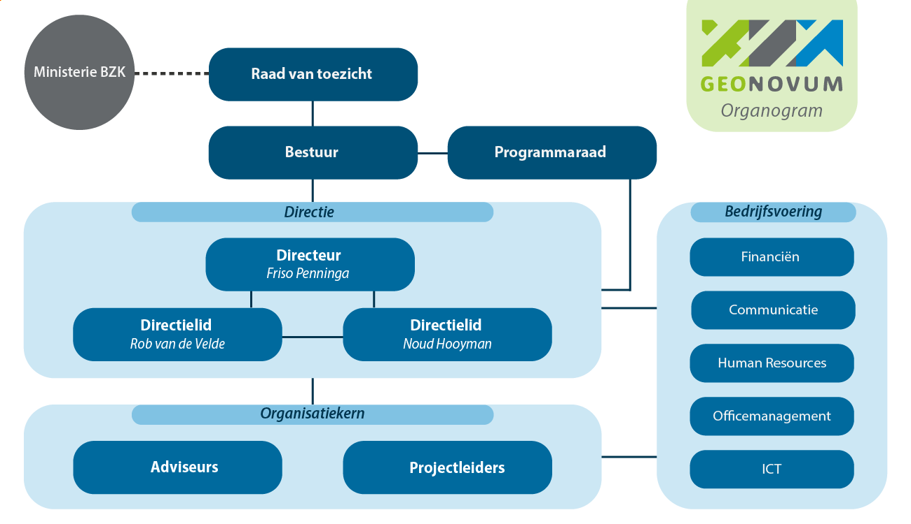

# Strategie {#070C7CCE}
Governance, visie en financiën zijn de strategische activiteiten voor het beheer van de geo-standaarden.
## Governance {#3867B86A}
Geonovum is een overheidsstichting met een onafhankelijk bestuur, een Raad van Toezicht en een programmaraad. De minister van BZK benoemt de leden van onze Raad van Toezicht. Onze missie, doelen, taken en jaarlijkse uitvoeringsplan staan op de Geonovum <a href='https://www.geonovum.nl/over-geonovum' target='_blank'>website</a>. De programmaraad adviseert het bestuur over de inhoud en prioriteiten voor het basisprogramma en over onze andere werkzaamheden. De ontwikkeling en het beheer van de geo-standaarden is een basistaak van Geonovum en is belegd in ons basisprogramma. De programmaraad treedt op als stuurgroep. De programmaraad beoordeelt en beslist over deze wijzigingsvoorstellen en stelt een nieuwe (versie) van de standaard vast van geo-standaarden die bij Geonovum in beheer zijn. Ook is de programmaraad aanspreekpunt voor klachten over het beheer (link) van de standaarden door Geonovum. De <a href='https://www.geonovum.nl/over-geonovum/wie-wij-zijn/programmaraad' target='_blank'>programmaraad</a> bestaat uit vertegenwoordigers van publieke organisaties in het geo-werkveld. Zij zijn de voornaamste belanghebbenden van Geonovum.
 
 
<figure></img>
<figcaption>Figuur 2 - Organogram Geonovum</figcaption></figure>

 
 
Jaarlijks adviseert de programmaraad aan het bestuur bindend over de inhoud van het basisprogramma. De Raad van Toezicht keurt het uitvoeringsplan, waarin het basisprogramma is opgenomen, goed voordat het bestuur het uitvoeringsplan vaststelt. Eenmaal per kwartaal rapporteert Geonovum aan de programmaraad en het bestuur over de voortgang in het basisprogramma.
Samenwerking met andere standaardisatieorganisaties is onderdeel van de governance. Mocht de beheertaak van Geonovum voor de basisset geo-standaarden vervallen, dan zullen de intellectuele eigendomsrechten overgaan naar de nieuwe beheerder of bij gebrek daaraan aan het ministerie van Binnenlandse Zaken en Koninkrijksrelaties.
## Visie {#7E9E8FB1}
Er zijn verschillende standaarden voor het vindbaar, toegankelijk, uitwisselbaar en herbruikbaar maken van geo-informatie. Elke standaard speelt een eigen rol en in samenhang toegepast zorgen ze voor de interoperabiliteit in een geo-informatie infrastructuur.
Om geo-informatie zo laagdrempelig mogelijk te ontsluiten is er in Nederland de Nationale Geo-Informatie Infrastructuur (NGII). De NGII als concept is het geheel van datasets (geo-informatie bronnen), data diensten, metadata, standaarden, voorzieningen, organisatie en afspraken voor de efficiënte uitwisseling van en toegang tot geo-informatie.
Een vraaggedreven infrastructuur, die de kracht van geo-informatie laagdrempelig inzetbaar maakt voor de grote maatschappelijke opgaven is de toekomst. Welke daarbij een rol spelen, hoe de afzonderlijke ontwikkelingen met elkaar samenhangen en zicht verhouden tot Europese ontwikkelingen rond data en digitalisering is beschreven in de <a href='https://docs.geostandaarden.nl/ngii/wpungii/' target='_blank'>Whitepaper Visie op upgrade Nederlandse Geo-informatie Infrastructuur(NGII)</a>. Het Raamwerk van Geo-Standaarden (link) helpt daarbij. Het benoemt de internationale en nationale standaarden die voor Nederland binnen het geo-domein van toepassing zijn voor aansluiting met andere domeinen. Het raamwerk houdt rekening met aansluiting op de Europese geo-informatie infrastructuur en borgt integratie van het geo-informatie domein in de Nederlandse digitale overheid.
## Financiën  {#1346C157}
Het beheer van de basisset geo-standaarden is onderdeel van ons basisprogramma. Dit programma wordt gesubsidieerd door ministeries van Binnenlandse Zaken en Koninkrijksrelaties en Landbouw, Natuur en Voedselveiligheid, van het Kadaster en van de Geologische Dienst Nederland TNO. Jaarlijks wordt bepaald welk deel van de basisfinanciering besteed wordt aan het standaardisatiewerk en daarmee het beheer van de basisset geo-standaarden. Over de besteding van de basisfinanciering leggen wij verantwoording af aan onze subsidieverleners en via het jaarverslag, inclusief jaarrekening voorzien van een goedkeurende accountantsverklaring.
