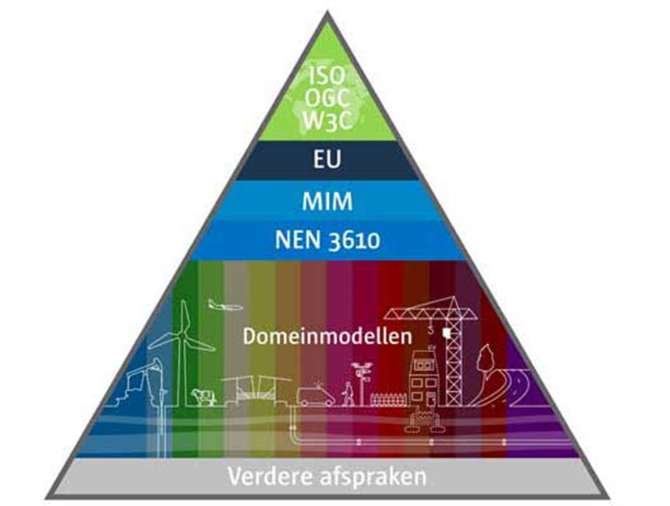

# Tactiek {#2F814D9C}
Community, architectuur, rechtenbeleid, adoptie en erkenning, kwaliteitsbeleid en benchmarking zijn de tactische activiteiten voor het beheer van de geo-standaarden.
## Community {#08F9EBAB}
Geonovum heeft een onafhankelijke positie als beheerder van de geo-standaarden. Het ontwikkelen en beheren van standaarden doen wij open en transparant. Betrokkenheid van de gemeenschap bij de verdere doorontwikkeling van de geo-standaarden is voor het gebruik en het draagvlak ervan van groot belang. De geo-standaarden gelden en worden gebruikt door publieke en private organisaties en bijvoorbeeld kennisinstellingen. Zij vormen samen de community. Alle publieke en private stakeholders, hebben inspraak over beheer en ontwikkeling van de betreffende geo-standaard (in vorm van leveranciers overleggen of klankbordgroepen) maar zijn niet beslissingsbevoegd. Aan deze inspraak zijn geen kosten verbonden.
 
 
Als er behoefte is aan (verdere) ontwikkeling van een standaard, stellen we hiervoor een werkgroep in. Werkgroepen staan voor iedereen open en er volgt altijd een openbare consultatie voor een nieuwe standaard of nieuwe versie van een standaard. Tijdens het maken van een standaard betrekken we relevante softwareleveranciers in het proces om het risico op een implementatiekloof zo klein mogelijk te houden.
 
 
Geonovum informeert en betrekt de geo-community via haar website en via haar nieuwsbrief ‘De Geostandaard’ (automatisch op de hoogte blijven? Meld je aan via de <a href='https://www.geonovum.nl' target='_blank'>Geonovum website</a>). Vanuit de community worden (al dan niet ad hoc) werkgroepen gevormd voor het klankborden over ontvangen verbeterverzoeken en de ontwikkeling van oplossingen op het moment dat dit nodig is. 
Geonovum werkt daarnaast samen met andere standaardisatieorganisaties zowel in als buiten het geo-informatie domein, bijvoorbeeld Informatiehuis Water, BIJ12, Logius.  
## Architectuur {#29CB745A}
De overheid beter laten presteren met geo-informatie. Dat is waar Geonovum dagelijks aan werkt. We doen dat door de toegankelijkheid van geo-informatie te verbeteren en door de uitwisseling van geo-informatie onderling en met andere soorten gegevens mogelijk te maken. Dit doen wij zowel in de context van de Nederlandse geo-informatie infrastructuur (NGII) als in de context van specifieke toepassingsdomeinen met standaarden. 
### Internationale standaarden {#37F3D7D2}
Voor de nationale geo-standaarden geldt dat deze ontwikkeld zijn op basis van internationale standaarden, aangevuld met de voor Nederland geldende specifieke eisen. Op het moment dat een nationale standaard (een toepassingsprofiel genaamd) is ontwikkeld, geldt dat een nationale standaard leidend is. Is er geen nationale standaard, dan geldt de Europese standaard en als er geen Europese standaard is, geldt een internationale, wereldwijde standaard.
Internationaal zijn voor Nederland de geo-standaarden afkomstig van standaardisatie organisaties <a href='https://www.iso.org/committee/54904.html' target='_blank'>ISO/TC 211 Geographic information/Geomatics</a>, het <a href='https://www.ogc.org/' target='_blank'>Open Geospatial Consortium</a> (OGC) en het <a href='https://www.w3.org/' target='_blank'>World Wide Web Consortium</a> (W3C) van groot belang. ISO/TC211 en het OGC maken technische geo-standaarden, die Nederland semantisch en technisch invult. Deze geo-standaarden organisaties hebben liaisons met de algemene ICT en Internet standaardisatie organisaties zoals het W3C. Geonovum participeert namens Nederland actief in deze drie internationale standaardisatie organisaties.
Ook internationale en nationale regelgeving heeft impact op de keuze voor standaarden. Vanuit Europa zijn onder meer de standaarden relevant die vallen onder de Europese <a href='https://inspire.ec.europa.eu/' target='_blank'>INSPIRE</a> kaderrichtlijn. Deze richtlijn beschrijft technische afspraken die uitwisseling van geo-informatie mogelijk maakt over 34 thema’s met betrekking tot de fysieke leefomgeving en het milieu. De INSPIRE richtlijn geldt specifiek voor publieke organisaties (de overheid) van de Europese lidstaten. De INSPIRE standaarden zijn gebaseerd op internationale geo-standaarden voor het vinden, bekijken en downloaden van data. De INSPIRE data specificaties voor de thema’s hebben een duidelijke relatie met de informatiemodellen voor verschillende domeinen en sectoren in Nederland.
In de afgelopen paar jaren heeft de Europese Commissie (EC) tevens meerdere wetsvoorstellen m.b.t. digitalisering en data gedaan die de komende jaren vorm krijgen. Gezamenlijk vormen ze de geopolitieke positionering t.a.v. digitalisering en data van de Europese Unie. Centraal in die propositie is het benutten van de maatschappelijke waarde van digitalisering en data, en gelijktijdig het versterken en beschermen van de individuele rechten van burgers. De voorstellen zijn in 2020 en 2021 gedaan, en zijn vastgesteld dan wel momenteel in onderhandeling. De bekend gemaakte feitelijke informatie over de inhoud van de voorstellen, de activiteiten van de EC, en de bekende tijdslijnen t.a.v. implementatie worden gedeeld in de <a href='https://docs.geostandaarden.nl/eu/handreiking-EU-informatie' target='_blank'>Handreiking EU Informatie m.b.t. digitale en data-strategie</a>.
Tot slot is ook nationale wet- en regelgeving van invloed op het toepassen de geo-standaarden, zoals de Nederlandse basisregistraties en de Omgevingswet. Deze Nederlandse profielen van standaarden zijn gebaseerd op of opgelijnd met de internationale en Europese profielen. Het deel van de Nederlandse geo-standaarden profielen dat zorgt voor het functioneren van de nationale geo-informatie infrastructuur heeft een aparte positie op de <a href='https://www.forumstandaardisatie.nl/open-standaarden' target='_blank'>'pas toe of leg uit'</a> lijst van verplichte open standaarden van het Forum Standaardisatie van de Nederlandse digitale overheid. Deze geo-standaarden zijn van primair belang in het aansluiten van geo-informatie op de digitale overheid.
 
 
 
<figure></img>
<figcaption>Figuur 3 - Het nationale NEN3610 Basismodel voor geo-informatie</figcaption></figure>

### Raamwerk van geo-standaarden  {#424234D4}
Bij de opzet en ontwikkeling van een geo-informatie infrastructuur is het de uitdaging om steeds de juiste set standaarden te kiezen. Het <a href='https://docs.geostandaarden.nl/rwgs/rw/' target='_blank'>Raamwerk van Geo-Standaarden</a> helpt daarbij. Het benoemt de internationale en nationale standaarden die voor Nederland binnen het geo-domein van toepassing zijn voor aansluiting met andere domeinen. Het raamwerk houdt rekening met aansluiting op de Europese geo-informatie infrastructuur en borgt integratie van het geo-informatie domein in de Nederlandse digitale overheid.
Het Raamwerk van geo-standaarden is geschreven voor iedereen die geodatasets vastlegt, uitwisselt en beheert en voor iedereen die informatiebeleid maakt. Het doel van het Raamwerk van geo-standaarden is om uit de grote verscheidenheid aan standaarden de juiste set te kiezen: die standaarden die nodig zijn om geodata vindbaar, toegankelijk, uitwisselbaar en herbruikbaar te maken. Wij baseren de keuzes voor standaarden in het Raamwerk op de volgende uitgangspunten: internationale aansluiting, volwassenheid en openheid van deze geo-standaarden en brede adoptie en gebruik. Het toepassen van de in dit raamwerk opgenomen geo-standaarden, draagt bij aan een solide geo-informatie infrastructuur, in lijn met internationale ontwikkelingen en aansluitend op de nationale digitale overheid.
### Metamodel voor informatiemodellering  {#22B2857E}
Het Metamodel voor Informatiemodellering (MIM) heeft als doel alle informatiemodellen in Nederland nog beter op elkaar aan te laten sluiten. Het beschrijft de 4 lagen, niveaus binnen een Informatiemodel. 
Niveau 1: Model van Begrippen
Niveau 2: Conceptueel Informatiemodel
Niveau 3: Logisch model of gegevensmodel
Niveau 4: Fysiek of Technisch model
 
 
Een typisch Geonovum Informatiemodel bevat in ieder geval niveau 2 en 3 en bij voorkeur ook niveau 1. Niveau 4 wordt gemaakt door de ontwikkelaar/ bouwer van het systeem waarin ons informatiemodel wordt gebruikt.
### Nederlandse Overheid Referentie Architectuur - NORA {#2E088CA6}
De Nederlandse Overheid Referentie Architectuur (NORA) is het interoperabiliteitsraamwerk voor de Nederlandse overheid en vertaalt daartoe wetgeving, beleid en standaarden naar architectuurprincipes, beschrijvingen en modellen. Het is een beschrijving van uitgangspunten voor het inrichten van de informatiehuishouding van de Nederlandse overheid. NORA is relevant voor de uitvoering van alle publieke taken door publieke en private organisaties. De geo-standaarden moeten ook passen binnen de <a href='https://www.noraonline.nl/' target='_blank'>Nederlandse Overheids Referentie Architectuur</a> (NORA), de architectuur van alle overheidsorganisaties in Nederland. 
Ook principes als <a href='https://www.noraonline.nl/wiki/Vindbaar_(Doel)' target='_blank'>Vindbaarheid</a>, <a href='https://www.noraonline.nl/wiki/Toegankelijk_(Doel)' target='_blank'>Toegankelijkheid</a> en <a href='https://www.noraonline.nl/wiki/Transparant_(Doel)' target='_blank'>Transparantie</a> zijn belangrijk in NORA evenals voor de nationale geo-informatie infrastructuur.
NORA stelt ook de “<a href='https://www.forumstandaardisatie.nl/open-standaarden' target='_blank'>pas-toe-of-leg-uit</a>” lijst van het Forum Standaardisatie verplicht. Een basisset met <a href='https://www.forumstandaardisatie.nl/open-standaarden/geo-standaarden' target='_blank'>geo-standaarden</a> staat ook op de 'pas-toe-of-leg-uit' lijst. De vermelding op deze lijst draagt bij aan de 'verankering' van de geo-standaarden en geo-informatie infrastructuur in de nationale digitale overheid.
Het Raamwerk van geo-standaarden is een aanvulling op en een verdieping van het <a href='https://www.noraonline.nl/wiki/Geo' target='_blank'>NORA thema GEO</a>. 
## Rechtenbeleid {#47DF3727}
Het onderwerp rechtenbeleid uit BOMOS vertaalt zich naar gebruiksvoorwaarden van de producten van de standaarden. Niet alleen voor de documentatie maar ook voor de technische bestanden. Daarbij staat centraal dat Geonovum open standaarden ontwikkelt en beheert. 
Geonovum hanteert <a href='https://creativecommons.nl/' target='_blank'>Creative Commons</a>  om voor de producten van de standaarden aan te geven voor wie op welke wijze de standaarden beschikbaar zijn. Voor elk  nieuw  document  dat  vanaf  1 januari 2018 door  Geonovum  wordt  gepubliceerd, is voorzien van  de volgende licentie:
<a href='https://creativecommons.org/licenses/by-nd/4.0/deed.nl' target='_blank'>https://creativecommons.org/licenses/by-nd/4.0/deed.nl</a> (kort: CC BY-ND 4.0). In het geval (delen van) standaarden zijn opgenomen in wet- en regelgeving (zoals het geval is bij de RO Standaarden) dan zijn de gebruiksvoorwaarden van Geonovum niet van toepassing. 
 
 
Geonovum dient er zelf voor zorg te dragen dat de documentatie van onze standaarden digitaal toegankelijk zijn. Dit is gebruiksvoorwaarde die vanuit wet- en regelgeving wordt gesteld. 
## Adoptie en erkenning {#1D2F46EE}
Het gebruik van de basisset geo-standaarden is niet vanzelfsprekend. De toepassing ervan in de praktijk is ons uiteindelijke doel. Werkgroepen zijn hierbij van wezenlijk belang. Voor de adoptie en erkenning van de geo-standaarden door het werkveld heeft Geonovum onder andere de basisset geo-standaarden aangeboden aan <a href='http://forumstandaardisatie.nl/' target='_blank'>Forum Standaardisatie</a>. Zij publiceren lijsten met open standaarden die door hen zijn goedgekeurd, waaronder <a href='https://www.forumstandaardisatie.nl/standaard/geo-standaarden' target='_blank'>de basisset geo-standaarden</a>. We maken geen gebruik van certificering. 
Daarnaast adviseren zij in het gebruik van open standaarden. In samenwerking met <a href='https://www.nen.nl/normcommissie-geo-informatie' target='_blank'>NEN normcommissie 351 240 Geo-informatie</a> streven wij naar adoptie en erkenning van het Basismodel Geo-informatie (NEN 3610). Voor NEN 3610 hebben we een conformiteitstoets. 
## Kwaliteitsbeleid en benchmarking {#03326BEB}
De verbindende kracht van standaardisatie in vindbare, toegankelijke, uitwisselbare en herbruikbare geo-informatie: 
<ul><li><b>Findable (vindbaar)</b> De eerste stap bij het (her)gebruiken van data is om de data te vinden. Metadata en data moeten gemakkelijk te vinden zijn voor zowel mensen als computers. Machineleesbare metadata is essentieel voor het ontdekken van datasets en services.</li>
<li><b>Accessible (toegankelijkheid)</b> Zodra de gebruiker de benodigde gegevens heeft gevonden, moet hij/zij weten hoe deze kunnen worden geraadpleegd, inclusief authenticatie en autorisatie.</li>
<li><b>Interoperable (interoperabel)</b> De gegevens moeten meestal worden geïntegreerd met andere gegevens. Bovendien moeten de gegevens samenwerken met applicaties of workflows voor analyse, opslag en verwerking.</li>
<li><b>Reusable (herbruikbaar)</b> Het uiteindelijke doel van FAIR is het hergebruik van data te optimaliseren. Om dit te bereiken moeten metadata en data goed worden beschreven, zodat ze in verschillende situaties kunnen worden gerepliceerd en/of gecombineerd.</li>
</ul>
 
 
Op basis van de kwaliteitsinstrumenten van BOMOS werken verder aan de kwaliteit van de standaarden en het beleid dat toeziet op de kwaliteit van implementaties van de geo-standaard. 
