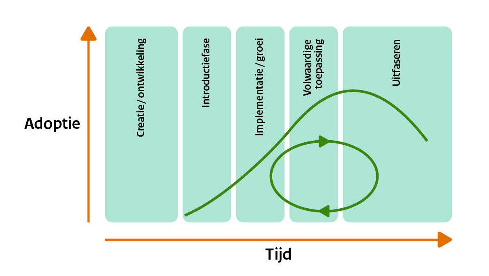

# Operationeel {#13C2BCAA}
Initiatie, wensen en eisen, ontwikkeling, uitvoering, documentatie en hulpmiddelen zijn onderdeel van de operationele activiteiten voor het beheer van de geo-standaarden.
## Initiatie {#2EDB09E7}
Initiatie gaat over nieuwe ontwikkelingen in het geo-informatiedomein die beslag krijgen in de basisset geo-standaarden. Identificatie van nieuwe ideeën voor bijvoorbeeld een nieuwe specificatie of een Nederlands profiel van een internationale standaard en alle activiteiten die horen bij het succesvol optuigen daarvan behoren tot initiatie. De leden van het standaardenteam van Geonovum maar ook ons netwerk signaleren de nieuwe ontwikkelingen.  
Als Geonovum nemen wij deel aan de werkgroepen van internationale standaarden om deze te vertalen naar het Nederlandse geo-informatiedomein. Ook zetten wij zelf testbeds en hackatons in om nieuwe ontwikkelingen te verkennen.
## Wensen en eisen {#79C4ED06}
Standaarden in beheer en gebruik ontwikkelen zich door. Belanghebbenden, gebruikers van de standaard, kunnen bij Geonovum wijzigingsverzoeken <a href='mailto:geo-standaarden@geonovum.nl' target='_blank'>indienen</a> variërend van wensen tot eisen. 
Op basis van het <a href='https://docs.geostandaarden.nl/gsw/gsw/' target='_blank'>wijzigingsprotocol geo-standaarden</a> nemen wij de wijzigingsverzoeken in behandeling en voeren wij ze door. Het wijzigingsprotocol is alleen van toepassing op de basisset geo-standaarden die in beheer zijn bij Geonovum: 
<ul><li>Basismodel geo-informatie (NEN 3610);</li>
<li>Geography Markup Language (GML);</li>
<li>Nederlandse metadataprofielen voor geografie en services;</li>
<li>Nederlandse profielen voor Web Feature Services (WFS) en Web Map Services (WMS).</li>
</ul>
 
 
Het wijzigingsprotocol geo-standaarden is ook van toepassing op elke nieuwe standaard die door Geonovum als basis geo-standaard wordt geclassificeerd, mits Geonovum deze in beheer heeft. 
Het wijzigingsprotocol geo-standaarden is niet van toepassing op de domeinstandaarden die Geonovum in beheer heeft; iedere domeinstandaard in beheer bij Geonovum heeft een eigen wijzigingsprotocol dat in lijn is met het wijzigingsprotocol geo-standaarden. 
 
 
Wijzigingsverzoeken worden gebundeld tot een wijzigingsvoorstel. Het wijzigingsprotocol geeft richting aan het wijzigingsproces dat het wijzigingsvoorstel doorloopt tot het vaststellen van de nieuwe X- of Y-versie van de standaard door de programmaraad (zie figuur 2). Z-wijzigingen worden door Geonovum zelf uitgevoerd zonder tussenkomst van de programmaraad.
Onderdeel van het wijzigingsproces is versiebeheer. 
 
 
<figure></img>
<figcaption>Figuur 4 - Proces vaststellen nieuwe standaard</figcaption></figure>

## Ontwikkeling {#1CE485E4}
Een standaard kent verschillende levensfasen, zie figuur 5. Iedere standaard in beheer kent deze levensfasen. Vanaf de implementatie/ groeifase is de standaard in beheer en ontwikkelt zich deze door.  
Bij de doorontwikkeling van de standaard doorloopt het wijzigingsproces stappen Inhoud, Toetsing, Besluitvorming en Implementatie. Het wijzigingsproces alsook het releasebeleid en versiebeheer zijn toegelicht zijn toegelicht in het <a href='https://docs.geostandaarden.nl/gsw/gsw/' target='_blank'>wijzigingsprotocol geo-standaarden</a>. De hulpmiddelen die het IMEV beheerteam inzet, zijn benoemd in de volgende paragraaf <a href='#78583B11'>uitvoering</a>. 
 
 
<figure></img>
<figcaption>Figuur 5 - Levensfases van een standaard volgens <a href='https://gitdocumentatie.logius.nl/publicatie/bomos/fundament/' target='_blank'>BOMOS</a></figcaption></figure>

## Uitvoering {#78583B11}
Voor de uitvoering van het beheer en de doorontwikkeling van de geo-standaarden zet Geonovum adviseurs geo-standaarden, informatiemodelleurs en communicatieadviseurs in. Onder leiding van de projectleider van het basisprogramma worden de werkzaamheden in het standaardenteam jaarlijks verdeeld. De leidraad daarbij is: 
<ul><li>De prioriteiten van het standaardenteam worden afgestemd met de programmaraad van Geonovum;</li>
<li>Het basisprogramma faciliteert verbinding tussen de beheeropdrachten en projecten van Geonovum, zowel op inhoud als op werkwijze en tooling voor het ontwikkelen van standaarden;</li>
<li>Het basisprogramma volgt en neemt deel aan relevante internationale standaardisatieorganisaties;</li>
<li>Het basisprogramma identificeert en verkent innovaties met mogelijke relevantie voor het geo-werkveld;</li>
<li>Toetsing doen wij samen met gebruikers- en expertgroepen.</li>
</ul>
 
 
Wij gebruiken hierbij de volgende hulpmiddelen en tooling. 
De <a href='https://www.geonovum.nl/' target='_blank'>Geonovum website</a> is de centrale toegang om in contact te komen met Geonovum en informatie in te winnen over ons werk: Geonovum verbindt, verkent en verankert. Dit betekent dat nieuwe opdrachten, nieuwe werkzaamheden, nieuwe thema’s via de Geonovum website worden ontsloten en alleen bij hoge uitzondering en een degelijke onderbouwing er een nieuwe separate website wordt ontwikkeld. 
De publieke werk- en ontwikkelomgeving van de standaarden en de producten van de standaarden is de <a href='https://github.com/Geonovum' target='_blank'>Geonovum GitHub</a>. Geonovum gebruikt voor de standaarden en de producten van de standaarden die wij ontwikkelen en beheren zogenoemde publicatieservers. Deze publicatieservers gelden als bronlocatie voor de producten van onze standaarden en zijn vindbaar. De publicatieservers zijn: 
<ul><li><a href='http://register.geostandaarden.nl/' target='_blank'>Technisch register</a>: Publiceren van technische bestanden, behorend bij standaarden ten behoeve van implementatieondersteuning. Het technisch register is de centrale vindplaats voor de informatiemodellen uit het NEN3610 stelsel, plus de technische standaarden die bij die informatiemodellen horen.</li>
<li><a href='https://definities.geostandaarden.nl/' target='_blank'>Conceptenbibliotheek</a>: Publiceren van semantische begrippen uit informatiemodellen. In de conceptenbibliotheek zijn de definities van concepten die gebruikt worden in NEN3610 informatiemodellen opgenomen, waarmee wij harmonisatie en integratie bevorderen.</li>
</ul>
Ten behoeve van de conceptenbibliotheek hebben we een <a href='https://staging-definities.geostandaarden.nl' target='_blank'>testomgeving van de conceptenbibliotheek</a>. 
<ul><li><a href='https://docs.geostandaarden.nl/' target='_blank'>Documenten register</a>: Publiceren van formele versies (consultatieversie, versie ter vaststelling, vastgestelde versie) van standaarden en eindversies van bijv. documentatie (type: document ‘GN-BASIS’). Door eenduidige, eenmalige bronlocatie van de (technische) documentatie van de standaarden die wij ontwikkelen en beheren in ReSpec (HTML) formaat, zijn de standaarden goed vindbaar op een persistente URI, voor zowel actieve als archiefversies. Met deze werkwijze voorkomen we het werken met oude kopieën (gebruik “standaarden bij de bron”). Daarnaast is de levensloop van standaarden volledig transparant. </li>
</ul>
## Documentatie {#2EE86838}
De volgende types documentatie worden door Geonovum gebruikt bij de ontwikkeling en het beheer van standaarden.  
 
 
<ul><li><b>Norm  (no) </b>Een norm is bij een officieel standaardisatie instituut ondergebracht en bevat bindende afspraken. Naast het gebruik van normen is NEN 3610 de enige norm waar Geonovum een inhoudelijke verantwoordelijkheid heeft. Het formele beheer en beslissingen worden genomen in de NEN normcommissie 351 240 waar Geonovum de voorzitter van is. NEN is een normalisatie instituut. NEN is net als Geonovum een stichting en kan daarmee geen juridische status toekennen aan normen. Het  verwijst vooral naar de status die de NEN heeft vanuit de overheid en in het werken vanuit lidstaten.  </li>
<li><b>Standaard  (st) </b>Een document met (bindende) afspraken. Overkoepelende term voor de verschillende types standaarden. Normen zijn in principe niet meer bindend dan standaarden. </li>
<li><b>Informatiemodel (im)</b> Een standaard waarbij door de term informatiemodel te hanteren wordt aangegeven dat het een abstractie (het model) vormt van de werkelijkheid zoals beschreven binnen een bepaalde sector/domein. Informatiemodellen zijn een semantische invulling van normen voor sectoren zoals ruimtelijke ordening, kabels en leidingen, water, etc..</li>
<li><b>Praktijkrichtlijn (pr) </b>Praktijkrichtlijnen zijn producten die informatie geven, vaak met een technisch karakter, die nodig is voor het toepassen van standaarden. Een praktijkrichtlijn hoort altijd bij een standaard/norm.</li>
<li><b>Best Practice</b> <b>(bp)</b> Best Practices zijn vergelijkbaar met prakrijkrichtlijnen. (Niet) normatieve Informatie over het toepassen van standaarden in de prakrijk. Een Best Practice hoort altijd bij een standaard.</li>
<li><b>Handreiking  (hr) </b>Op zichzelf staande documentatie dat als doel heeft een hulpmiddel te zijn, niet verplichtend maar ondersteunend.</li>
<li><b>Werkafspraak (wa) </b>Legt uit hoe wetgeving moet worden toegepast bij onduidelijkheden, discrepanties of fouten in de standaarden.</li>
<li><b>Algemeen</b>  <b>(al)</b> Op zichzelf staande algemene documentatie over standaarden. De documentatie betreft niet een specifieke standaard of onderdeel daarvan, het is ook geen beheerdocumentatie van een specifieke standaard.</li>
<li><b>Beheerdocumentatie</b> <b>(bd)</b> Documentatie met betrekking tot het beheerproces van de standaard. Deze documentatie betreft niet een standaard of onderdeel daarvan, zoals een handreiking of werkafspraak. Dit kan interne gerichte documentatie zijn voor vastleggen van stappen in het dagelijkse werkproces, planning of hoe de helpdesk werkt. Ook kan dit een beheerplan of handboek zijn. Als dit soort documentatie publiekelijk beschikbaar wordt gesteld, dan gebeurt dit door middel van ReSpec. </li>
</ul>
